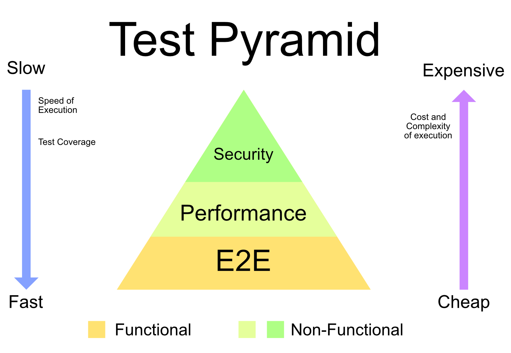
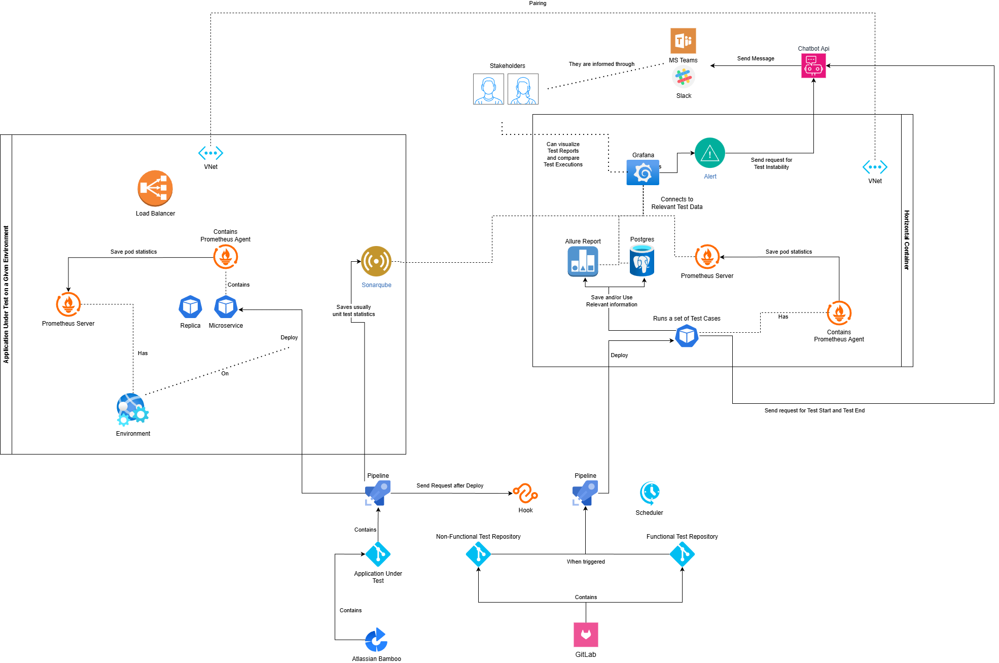

# Technical Interview Assignment Test Strategy #

This document provides a high-level guide for test activities and quality evalutations within the **Logging Backend** application. It defines the overall test approach to ensure the delivered software meets established quality standards and business expectations.

The test strategy outlines the scope and objectives of testing, applicable test types and levels, and the roles and responsibilities involved in the testing process. It serves as a shared reference for all stakeholders, including developers, testers, project managers, and business representatives, promoting a common understanding of how quality is planned, evaluated, and maintained throughout the project.

## Terminology

The following terms are used in this document and are defined here for clarity and consistency.

| Term              | Short Definition                                                                                     |
| ----------------- | ---------------------------------------------------------------------------------------------------- |
| **OKR**           | Objectives and Key Results used to align teams on measurable quality and delivery goals.             |
| **Quality**       | The degree to which a product meets requirements, user expectations, and business goals.             |
| **Processes**     | Structured activities and rules followed to build, test, and deliver software consistently.          |
| **Artifacts**     | Documents or outputs produced during the software development and testing lifecycle.                 |
| **Test Plan**     | A document that defines test objectives, scope, approach, schedule, responsibilities and Test Cases. |
| **Test Case**     | A set of conditions, inputs, and expected results used to verify a specific behavior.                |
| **Quality Gates** | Checkpoints used to verify that defined quality criteria are met before proceeding.                  |
| **Bugs**          | Technical flaws in the software that cause incorrect or unexpected results.                          |
| **Severity**      | The level of impact a bug has on system functionality or user experience.                            |
| **Priority**      | The order in which a bug should be fixed based on business importance.                               |
| **Risks**         | Potential events or conditions that may negatively affect quality, schedule, or scope.               |
| **KPI**           | Key Performance Indicator used to measure testing effectiveness and quality performance.             |

## Test Pyramid

The Test Pyramid is a model that guides how to structure and balance tests to achieve fast, reliable, and cost-effective feedback. Often it is portraited without the combination of different groups of test (Functional and Non-Functional). Also, usually contains a generic layout that doesn't apply correctly to a specific context. This being said, the image bellow, presents a custom tailored visualization for this specific project. 

The depiction above, still follows the general idea of a Test Pyramid being:

- Higher it's position: requires ***more*** computational resources being ***complex*** and ***costly*** to create and run a given test case.
- Lower it's position: requires ***less*** computational resources being ***simpler*** and ***cheap*** to create and run a given test case.
- Wider the block: tends to be ***cheaper*** to cover business rules and thus have ***higher*** test count.
- Slimmer the block: tends to be ***expesive*** to cover business rules and thus have ***lower*** test count.

### Functional Testing

A Functional Test verifies that the system behaves according to defined requirements by validating features, inputs, and expected outputs.
There are several different types that have been ommited during this document, simply because goes out of scope. Among them, are Unit tests, Integration Tests, Component Tests, Contract tests and User Acceptance Tests.

#### E2E Test

Validates complete user or system workflows by testing the application from start to finish across all integrated components. It requires the Application Under Test to be up and running with all its dependencies.

### Non-Functional Testing

A Non-Functional Test evaluates how the system performs under specific conditions, focusing on attributes such as performance, security, reliability, and usability, being the last not covered in this document due scope restrictions.

| Test Type            | One-Line Description                                                                                           |
| -------------------- | -------------------------------------------------------------------------------------------------------------- |
| **Performance Test** | Measures system responsiveness, throughput, and stability under expected workloads.                            |
| **Scalability Test** | Evaluates the system’s ability to handle increased load by scaling users, data, or resources.                  |
| **Reliability Test** | Assesses the system’s ability to operate correctly and consistently over time without failure.                 |
| **Security Test**    | Identifies vulnerabilities and verifies that the system protects data, access, and functionality from threats. |

## Test Architecture

## Application Under Test

The Application Under Test (AUT) being topic of this Test Strategy, is composed only by a Backend application. It contains a subset of endpoints of whom represents a logging platform backend. All the traits related to its functionality and how well it performs are consider under scope. It is consider as out of scope, are future 3rd party service integrations of whom this maintainer team isn't accountable for.

### Links

- [App Documentation](../logging-backend/README.md)
- [Repositories](../logging-backend/)

### Caveats

- For now, the Application Under Test isn't hosted anywhere. Every test will be triggered locally, having the AUT self-hosted alongside with it. Such approach is highly disencouraged since its heavily impacts test results reliability and consistency.

## Alignment 

### Involved OKRs

Keep track of anually estrablished OKR on a high-level description

### Display the team composition and RACI matrix

Make sure that a RACI matrix is in place.

## Reporting

### Quality Gates

