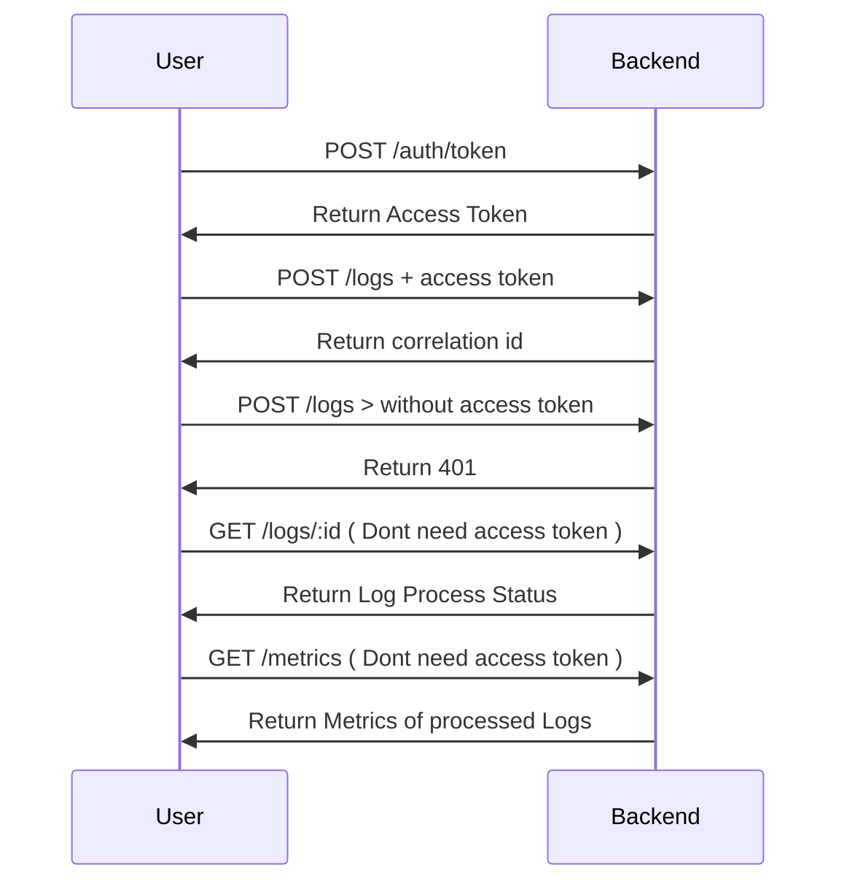

# Sample Logging Backend (Final)

This backend is provided **as-is** for QA automation take-home challenges.
Candidates must NOT modify backend code.

## Behaviors

This API has some behaviors that aren't documented, you need to test and find.

## Run
```shell
docker-compose up --build
```

or if you want to start locally

```shell
npm i
npm run start
```

## Environment Variables

If you want, you can change some environment variables to change the API behavior:

- RATE_LIMIT:
    - Type: int
    - Purpose: Number of requests per minute
- SLOW_DEP_MS
    - Type: float
    - Purpose: Simulates slow behavior

If you are running locally, you can just export the variables to our session or in case of using [docker-compose.yml](./docker-compose.yml) look for the environment variables session.

## Swagger
http://localhost:3000/docs

## Request Flow



**Example of processing**: [seed.js](./seed.js)

